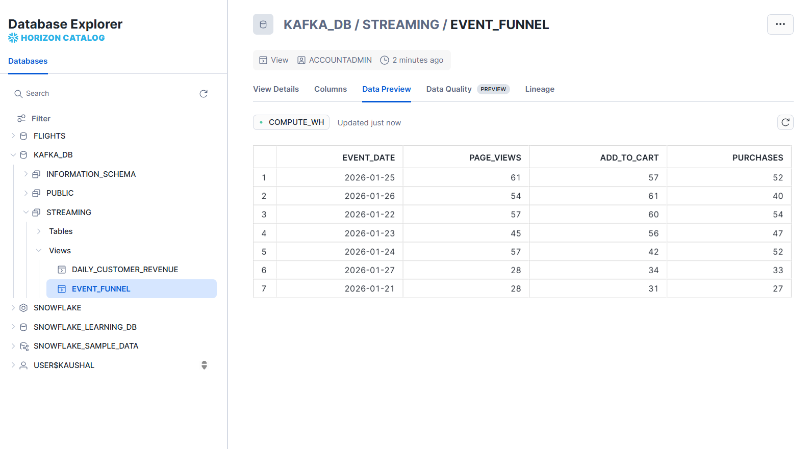
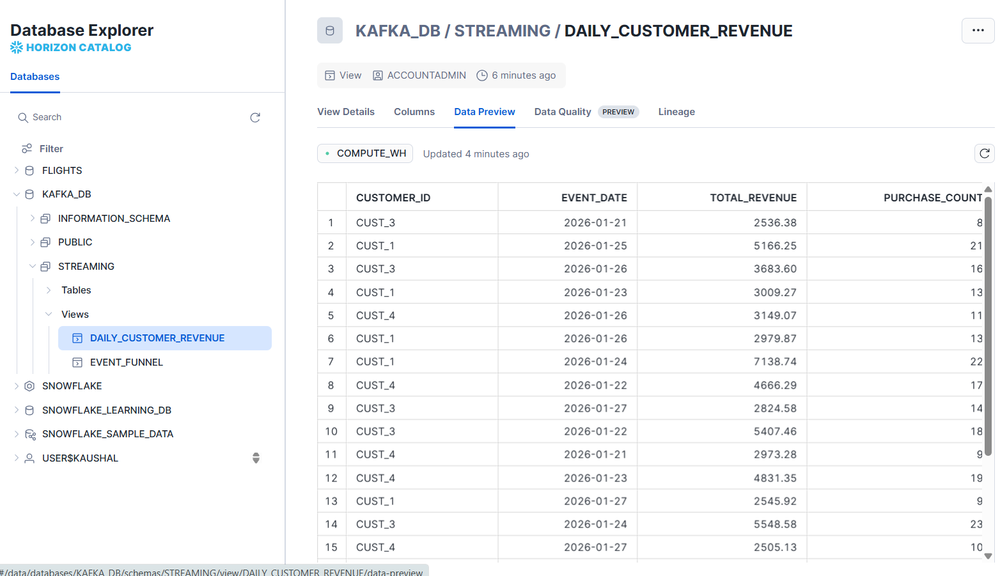
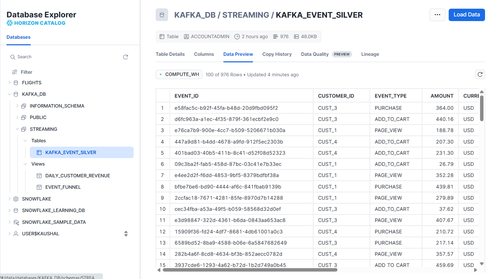

#### kafka-snowflake-data-analysis

**end-to-end real-time data engineering project using Apache Kafka, Python, and Snowflake.**

- This project demonstrates how Kafka is actually used in real systems — including message keys, partitioning, streaming data validation, offset management, and warehouse-first analytics — not just basic producers and consumers.

- We follow a Medallion Architecture (Bronze → Silver → Gold) approach, where:
Kafka handles real-time ingestion and data quality
Python handles stream processing
Snowflake handles analytics and business logic using SQL

#### Run Docker Compose file for Kafka setup.
```bash
docker-compose up -d (start)
docker-compose down -v (delete)
```

#### Create Virtual environment and actuvate.
```bash
python -m venv ecoom-kafka
env/scripts/activate
```

#### install python required libraries. 
```bash
pip install kafka-python
pip install snowflake-connector-python
pip freeze
pip freeze > requirements.txt
```

#### Activate kafka Container.
```bash
docker exec -it kafka bash
cd /opt/kafka/bin (if you are using (Kafka Raft) in ZooKeeper not needed)
```

#### Create a kafka topic.
```bash
(kafka-topics.sh select this for create topic)
(kafka Raft)
./kafka-topics.sh \
--create --topic raw_events \
--bootstrap-server kafka:9092 \
--partitions 3 \
--replication-factor 1

(ZoKeeper)
kafka-topics \
  --create \
  --topic raw_events \
  --bootstrap-server localhost:9092 \
  --partitions 3 \
  --replication-factor 1
```

#### Get list of all the topics.
```bash
(kafka Raft)
./kafka-topics.sh --list --bootstrap-server kafka:9092

(ZoKeeper)
kafka-topics --list --bootstrap-server localhost:9092
```

#### describe Created topic in detail.
```bash
(kafka Raft)
./kafka-topics.sh --describe --topic raw_events --bootstrap-server kafka:9092
OR 
./kafka-topics.sh --describe --topic raw_events --bootstrap-server host.docker.internal:29092

(ZoKeeper)
kafka-topics \
  --describe \
  --topic raw_events \
  --bootstrap-server localhost:9092

```

### Run Prodcuer.py file

#### Show the message that created my producer Consume messages from raw_events
```bash
(ZoKeeper)
kafka-console-consumer \
  --bootstrap-server localhost:9092 \
  --topic raw_events \
  --from-beginning
```

#### delete all the messages from raw_events.
```bash
(ZoKeeper)
kafka-topics \
  --bootstrap-server localhost:9092 \
  --delete \
  --topic raw_events
```

#### message count according to topic.
```bash
(ZoKeeper)
kafka-run-class kafka.tools.GetOffsetShell \
  --broker-list localhost:9092 \
  --topic raw_events \
  --time -2
```

####
```bash
(kafka Raft)
(ZoKeeper)
```

#### Snowflake tables and views that created for data analysis.

#### Data According to date


#### Daily customer revenue acording to date


#### all E-com customer data 
